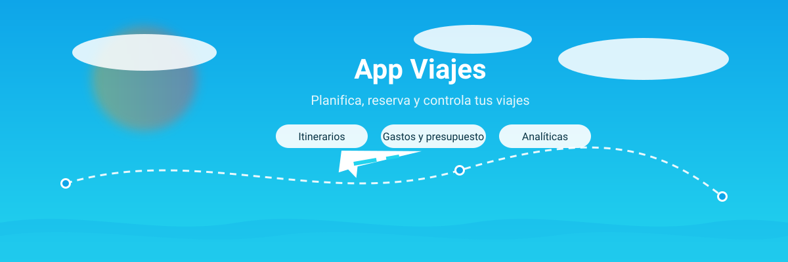

<div align="center">
  
  <h1>App Viajes</h1>
  <p><strong>Planifica, reserva y controla tus viajes</strong><br/>Una plataforma completa para itinerarios, gastos, presupuestos y analíticas.</p>

  <p>
    <a href="#instalacion">Instalación</a> ·
    <a href="#caracteristicas">Características</a> ·
    <a href="#documentacion">Documentación</a> ·
    <a href="#capturas">Capturas</a> ·
    <a href="#roadmap">Roadmap</a>
  </p>

  <p>
    
    
    
    
    
  </p>
</div>

## 📋 Descripción

App Viajes es una aplicación web colaborativa para gestionar todo el ciclo de un viaje: creación de itinerarios, control de gastos, presupuestos inteligentes y analíticas visuales. El proyecto enfatiza documentación clara, estándares de calidad y un flujo de trabajo profesional.

## 🚀 Características

- ✅ Gestión completa de viajes: crear, editar y organizar itinerarios
- 💸 Control de gastos por viaje con categorías y métricas
- 💼 Presupuestos inteligentes y seguimiento financiero
- 📊 Dashboard analítico con visualizaciones interactivas
- 🔐 Autenticación segura con Supabase Auth
- 🧭 Integración con Amadeus API para datos de vuelos
- 🧩 Logger centralizado y notificaciones toast
- 📱 Diseño responsive y accesible

---

## 🖼️ Banner / Capturas

<div align="center">
  
  <p><em>Banner hero del repositorio. Se puede reemplazar por capturas reales del dashboard o páginas clave.</em></p>
  
</div>

---

## 🗂️ Estructura del Proyecto

```
app-viajes/
├── src/
│   ├── app/                 # Rutas y páginas (App Router)
│   ├── components/          # UI y componentes por dominio
│   ├── lib/                 # Servicios, clientes y utilidades
│   └── contexts/            # Contextos de React
├── docs/                    # Documentación colaborativa (MDs mejorados)
├── .github/                 # Workflows, plantillas y labels
├── testsprite_tests/        # Suite de pruebas automatizadas
└── README.md                # Landing del repositorio (esta página)
```

---

## ⚙️ Instalación y Uso

### Prerrequisitos
- Node.js 18+
- npm o yarn
- Cuenta de Supabase (Auth/DB)
- API Key de Amadeus (opcional)

### Instalación
```bash
# Clonar el repositorio
git clone https://github.com/PabloJustDevelops/colaboracion-alejandro-app-viajes.git
cd colaboracion-alejandro-app-viajes

# Instalar dependencias
npm install
```

### Configuración
```bash
# Copiar variables de entorno
cp .env.example .env.local

# Variables necesarias
NEXT_PUBLIC_SUPABASE_URL=tu_supabase_url
NEXT_PUBLIC_SUPABASE_ANON_KEY=tu_supabase_anon_key
AMADEUS_CLIENT_ID=tu_amadeus_client_id
AMADEUS_CLIENT_SECRET=tu_amadeus_client_secret
```

### Ejecución
```bash
# Desarrollo
npm run dev

# Tests
npm test

# Producción
npm run build

# Lint y formato
npm run lint
npm run format
```

La app corre en `http://localhost:3000`.

### Uso rápido
- Autenticación: registro/login
- Crear viaje: `/trips`
- Gastos por viaje: `/expenses`
- Presupuestos: `/budget`
- Analíticas: `/analytics`

📖 **Documentación Colaborativa**

La documentación detallada está en `docs/`:

- **[TECHNICAL.md](docs/TECHNICAL.md)**: Guía técnica y configuración
- **[CONTRIBUTING.md](docs/CONTRIBUTING.md)**: Cómo contribuir
- **[ARCHITECTURE.md](docs/ARCHITECTURE.md)**: Arquitectura y patrones
- **[BRANCHING.md](docs/BRANCHING.md)**: Estrategia de ramas y workflow
- **[PR_PROCESS.md](docs/PR_PROCESS.md)**: Proceso de Pull Requests
- **[COMMITS.md](docs/COMMITS.md)**: Convenciones de commits

---

## 🧪 Testing

Suite con **Jest** y **Testsprite**:
```bash
npm test                  # Suite completa
npm run test:auth         # Autenticación
npm run test:trips        # Gestión de viajes
npm run test:expenses     # Gastos
```

Coberturas:
- Autenticación y autorización
- CRUD de viajes y gastos
- Validaciones de formularios
- Integración con APIs
- Componentes de UI críticos

## 🔧 Tecnologías

- Frontend: Next.js 15, React 18, TypeScript
- Estilos: Tailwind CSS, componentes personalizados
- Backend: Supabase (PostgreSQL, Auth, Storage)
- APIs: Amadeus API
- Testing: Jest, Testsprite
- CI/CD: GitHub Actions
- Linting: ESLint, Prettier
- Commits: Commitlint, Conventional Commits

## 📊 Estado del Desarrollo

**✅ Funcionalidades Completadas**
- Sistema de autenticación completo
- CRUD de viajes con validaciones
- Gestión de gastos por categorías
- Dashboard con métricas principales
- Sistema de presupuestos
- Analíticas con gráficos interactivos
- Logger centralizado con toast notifications
- Diseño responsive y accesible

**🔄 En Desarrollo**
- Filtros avanzados en analíticas
- Exportación de datos (PDF/Excel)
- Notificaciones push
- Modo offline básico

## 📋 Roadmap
- Internacionalización (i18n)
- Integración con más APIs de viajes
- Sistema de colaboración en viajes
- App móvil (React Native)

## 👥 Contribuidores

- **[Pablo Rodríguez Garijo](https://github.com/PabloJustDevelops)** - Desarrollador principal
- **Alejandro García Redondo** - Desarrollador ayudante


---

> Nota: Proyecto colaborativo enfocado en buenas prácticas, documentación y flujo profesional.

## 🤝 Contribuir

¡Las contribuciones son bienvenidas! Por favor:

1. Fork el proyecto
2. Crea una rama para tu feature (`git checkout -b feature/AmazingFeature`)
3. Commit tus cambios (`git commit -m 'Add some AmazingFeature'`)
4. Push a la rama (`git push origin feature/AmazingFeature`)
5. Abre un Pull Request

Consulta [CONTRIBUTING.md](docs/CONTRIBUTING.md) para más detalles.

## 📄 Licencia

Este proyecto está bajo la Licencia MIT. Ver `LICENSE` para más información.

## 📞 Contacto

Pablo Rodríguez Garijo - [@PabloJustDevelops](https://github.com/PabloJustDevelops)

Link del proyecto: [https://github.com/PabloJustDevelops/Proyecto-TravelPal-App-de-Viajes](https://github.com/PabloJustDevelops/Proyecto-TravelPal-App-de-Viajes)
