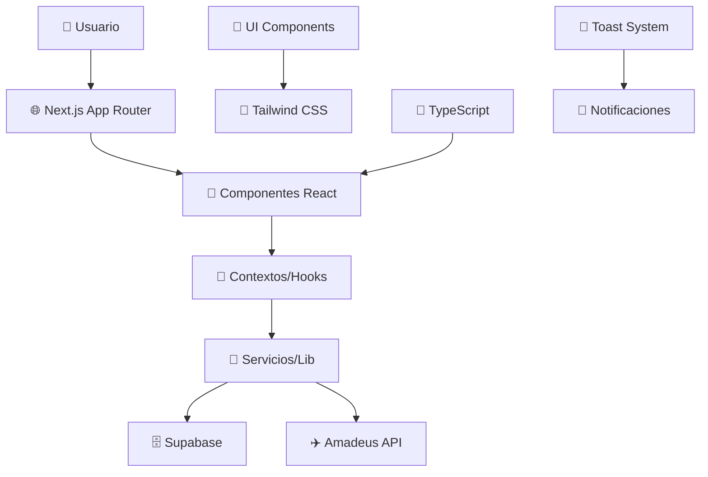
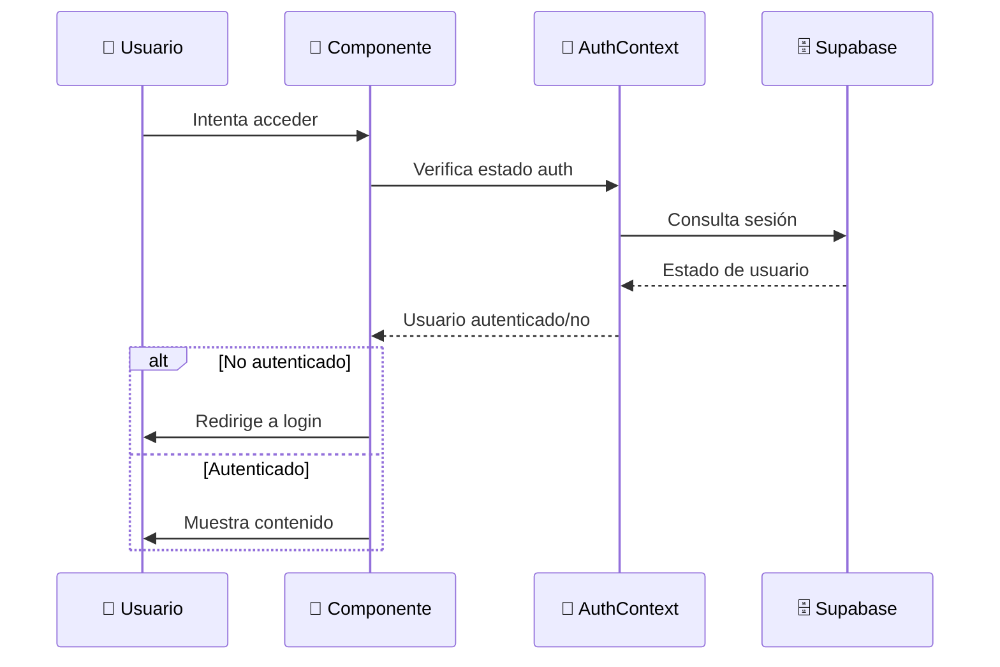

# 🏗️ Arquitectura del Sistema

> **Diseño y patrones arquitectónicos del proyecto App Viajes**

---

## 🎯 Visión General

**App Viajes** es una aplicación web moderna construida con **Next.js 14** utilizando el **App Router**, **React 18**, y **TypeScript**. La arquitectura sigue principios de **separación de responsabilidades**, **componentes reutilizables** y **gestión centralizada del estado**.

### 🔧 **Stack Tecnológico Principal**

| Capa | Tecnología | Propósito |
|------|------------|-----------|
| 🎨 **Frontend** | Next.js 14 + React 18 | Framework y UI |
| 📝 **Lenguaje** | TypeScript | Tipado estático |
| 🎨 **Estilos** | Tailwind CSS | Diseño y responsive |
| 🗄️ **Base de Datos** | Supabase | Backend as a Service |
| 🔐 **Autenticación** | Supabase Auth | Gestión de usuarios |
| ✈️ **API Externa** | Amadeus API | Datos de viajes |

---

## 📁 Estructura del Proyecto

```
src/
├── 📂 app/                          # 🏠 App Router (Next.js 14)
│   ├── 📄 layout.tsx                # Layout raíz con providers
│   ├── 📄 page.tsx                  # Página de inicio
│   ├── 📄 globals.css               # Estilos globales
│   ├── 📂 auth/                     # Rutas de autenticación
│   │   ├── 📄 login/page.tsx        # Página de login
│   │   └── 📄 register/page.tsx     # Página de registro
│   ├── 📂 dashboard/                # Panel principal
│   │   └── 📄 page.tsx              # Dashboard de usuario
│   └── 📂 api/                      # API Routes (si aplica)
│
├── 📂 components/                   # 🧩 Componentes reutilizables
│   ├── 📂 ui/                       # Componentes base de UI
│   │   ├── 📄 Button.tsx            # Botón reutilizable
│   │   ├── 📄 Input.tsx             # Input con validación
│   │   ├── 📄 Toast.tsx             # Sistema de notificaciones
│   │   └── 📄 Modal.tsx             # Modal genérico
│   ├── 📂 auth/                     # Componentes de autenticación
│   │   ├── 📄 LoginForm.tsx         # Formulario de login
│   │   ├── 📄 RegisterForm.tsx      # Formulario de registro
│   │   └── 📄 AuthGuard.tsx         # Protección de rutas
│   ├── 📂 travel/                   # Componentes de viajes
│   │   ├── 📄 SearchForm.tsx        # Búsqueda de vuelos
│   │   ├── 📄 FlightCard.tsx        # Tarjeta de vuelo
│   │   └── 📄 BookingForm.tsx       # Formulario de reserva
│   └── 📂 layout/                   # Componentes de layout
│       ├── 📄 Header.tsx            # Cabecera principal
│       ├── 📄 Navigation.tsx        # Navegación
│       └── 📄 Footer.tsx            # Pie de página
│
├── 📂 lib/                          # 🔧 Utilidades y configuración
│   ├── 📄 supabase.ts               # Cliente de Supabase
│   ├── 📄 logger.ts                 # Sistema de logging
│   ├── 📄 toast.ts                  # Gestión de toasts
│   ├── 📄 amadeus.ts                # Cliente de Amadeus API
│   └── 📄 utils.ts                  # Utilidades generales
│
├── 📂 contexts/                     # 🔄 Contextos de React
│   ├── 📄 AuthContext.tsx           # Estado de autenticación
│   └── 📄 ToastContext.tsx          # Estado de notificaciones
│
├── 📂 hooks/                        # 🪝 Custom Hooks
│   ├── 📄 useAuth.ts                # Hook de autenticación
│   ├── 📄 useToast.ts               # Hook de notificaciones
│   └── 📄 useFlights.ts             # Hook para búsqueda de vuelos
│
├── 📂 types/                        # 📝 Definiciones de tipos
│   ├── 📄 auth.ts                   # Tipos de autenticación
│   ├── 📄 travel.ts                 # Tipos de viajes
│   └── 📄 api.ts                    # Tipos de API
│
└── 📂 styles/                       # 🎨 Estilos adicionales
    └── 📄 components.css            # Estilos de componentes
```

---

## 🔄 Flujo de Datos

### 📊 **Diagrama de Arquitectura**



### 🔐 **Flujo de Autenticación**



---

## 🧩 Componentes Clave

### 🔐 **Sistema de Autenticación**

#### **AuthContext** (`src/contexts/AuthContext.tsx`)
- 🎯 **Propósito**: Gestión centralizada del estado de autenticación
- 🔄 **Estado**: Usuario actual, estado de carga, métodos de auth
- 🛡️ **Funciones**: Login, logout, registro, recuperación de contraseña

```typescript
interface AuthContextType {
  user: User | null;
  loading: boolean;
  signIn: (email: string, password: string) => Promise<void>;
  signUp: (email: string, password: string) => Promise<void>;
  signOut: () => Promise<void>;
}
```

#### **AuthGuard** (`src/components/auth/AuthGuard.tsx`)
- 🛡️ **Propósito**: Protección de rutas privadas
- 🔄 **Funcionamiento**: Verifica autenticación antes de renderizar
- 🚪 **Redirección**: Automática a login si no está autenticado

### 📢 **Sistema de Notificaciones**

#### **Toast System** (`src/lib/toast.ts` + `src/components/ui/Toast.tsx`)
- 🎯 **Propósito**: Feedback visual centralizado
- 🎨 **Tipos**: Success, error, warning, info
- ⏱️ **Auto-dismiss**: Configuración de tiempo automático
- 🔄 **Integración**: Con logger para errores automáticos

```typescript
interface ToastOptions {
  type: 'success' | 'error' | 'warning' | 'info';
  duration?: number;
  persistent?: boolean;
}
```

### 📊 **Sistema de Logging**

#### **Logger** (`src/lib/logger.ts`)
- 📝 **Propósito**: Logging centralizado y estructurado
- 🎯 **Niveles**: Debug, info, warn, error
- 🔄 **Integración**: Automática con sistema de toasts
- 🌍 **Configuración**: Por variable de entorno `LOG_LEVEL`

```typescript
interface Logger {
  debug: (message: string, data?: any) => void;
  info: (message: string, data?: any) => void;
  warn: (message: string, data?: any) => void;
  error: (message: string, error?: Error) => void;
}
```

---

## 🗄️ Gestión de Datos

### **Supabase Integration**

#### **Cliente** (`src/lib/supabase.ts`)
- 🔧 **Configuración**: Cliente singleton de Supabase
- 🔐 **Autenticación**: Integración con Auth de Supabase
- 📊 **Base de datos**: Queries tipadas con TypeScript
- 🔄 **Real-time**: Subscripciones a cambios en tiempo real

#### **Estructura de Datos**
```sql
-- Usuarios (gestionado por Supabase Auth)
auth.users

-- Perfiles de usuario
public.profiles (
  id uuid references auth.users,
  full_name text,
  avatar_url text,
  created_at timestamp
)

-- Reservas de viajes
public.bookings (
  id uuid primary key,
  user_id uuid references auth.users,
  flight_data jsonb,
  status text,
  created_at timestamp
)
```

### **API Externa - Amadeus**

#### **Cliente** (`src/lib/amadeus.ts`)
- ✈️ **Propósito**: Integración con Amadeus Travel API
- 🔍 **Funciones**: Búsqueda de vuelos, hoteles, destinos
- 🔐 **Autenticación**: OAuth2 con refresh automático
- ⚡ **Cache**: Implementación de cache para optimizar requests

---

## 🎨 Sistema de Estilos

### **Tailwind CSS**
- 🎯 **Utility-first**: Clases utilitarias para desarrollo rápido
- 📱 **Responsive**: Mobile-first design
- 🎨 **Customización**: Tema personalizado en `tailwind.config.js`
- 🌙 **Dark Mode**: Soporte para modo oscuro (futuro)

### **Organización de Estilos**
```css
/* globals.css - Estilos base */
@tailwind base;
@tailwind components;
@tailwind utilities;

/* Componentes personalizados */
@layer components {
  .btn-primary {
    @apply bg-blue-600 hover:bg-blue-700 text-white font-medium py-2 px-4 rounded-lg;
  }
}
```

---

## 🔧 Patrones de Diseño

### 🏭 **Compound Components**
Para componentes complejos como modales y formularios:

```typescript
// Modal.tsx
export const Modal = ({ children, isOpen, onClose }) => { /* ... */ };
Modal.Header = ({ children }) => { /* ... */ };
Modal.Body = ({ children }) => { /* ... */ };
Modal.Footer = ({ children }) => { /* ... */ };

// Uso
<Modal isOpen={isOpen} onClose={handleClose}>
  <Modal.Header>Título</Modal.Header>
  <Modal.Body>Contenido</Modal.Body>
  <Modal.Footer>Acciones</Modal.Footer>
</Modal>
```

### 🪝 **Custom Hooks**
Para lógica reutilizable:

```typescript
// useAuth.ts
export const useAuth = () => {
  const context = useContext(AuthContext);
  if (!context) {
    throw new Error('useAuth must be used within AuthProvider');
  }
  return context;
};
```

### 🔄 **Provider Pattern**
Para estado global:

```typescript
// RootLayout.tsx
export default function RootLayout({ children }) {
  return (
    <html>
      <body>
        <AuthProvider>
          <ToastProvider>
            {children}
          </ToastProvider>
        </AuthProvider>
      </body>
    </html>
  );
}
```

---

## 🚀 Decisiones Arquitectónicas

### ✅ **Decisiones Tomadas**

| Decisión | Razón | Alternativas Consideradas |
|----------|-------|---------------------------|
| **Next.js App Router** | SSR, SEO, performance | Pages Router, Vite + React |
| **Supabase** | BaaS completo, auth integrada | Firebase, custom backend |
| **Tailwind CSS** | Desarrollo rápido, consistencia | Styled Components, CSS Modules |
| **TypeScript** | Type safety, mejor DX | JavaScript puro |
| **Context API** | Estado simple, nativo de React | Redux, Zustand |

### 🔄 **Patrones Implementados**

- **🏗️ Separation of Concerns**: Separación clara entre UI, lógica y datos
- **🧩 Component Composition**: Componentes pequeños y reutilizables
- **🔄 Unidirectional Data Flow**: Flujo de datos predecible
- **🛡️ Error Boundaries**: Manejo de errores a nivel de componente
- **📱 Mobile First**: Diseño responsive desde mobile

---

## 🔮 Roadmap Arquitectónico

### 🎯 **Próximas Mejoras**

- [ ] 🧪 **Testing**: Implementar Jest + React Testing Library
- [ ] 📊 **State Management**: Migrar a Zustand para estado complejo
- [ ] 🌙 **Dark Mode**: Implementar tema oscuro
- [ ] 🔄 **PWA**: Convertir en Progressive Web App
- [ ] 📈 **Analytics**: Integrar sistema de métricas
- [ ] 🚀 **Performance**: Implementar lazy loading y code splitting
- [ ] 🔐 **Security**: Auditoría de seguridad y OWASP compliance

### 📊 **Métricas y Monitoreo**

- **Performance**: Core Web Vitals, Lighthouse scores
- **Errores**: Sentry o similar para error tracking
- **Analytics**: Google Analytics o Plausible
- **Uptime**: Monitoreo de disponibilidad

---

## 📚 Referencias y Recursos

### 📖 **Documentación Oficial**
- [Next.js App Router](https://nextjs.org/docs/app)
- [React 18 Features](https://react.dev/blog/2022/03/29/react-v18)
- [Supabase Docs](https://supabase.com/docs)
- [Tailwind CSS](https://tailwindcss.com/docs)

### 🛠️ **Herramientas de Desarrollo**
- [TypeScript Handbook](https://www.typescriptlang.org/docs/)
- [ESLint Rules](https://eslint.org/docs/rules/)
- [Prettier Configuration](https://prettier.io/docs/en/configuration.html)

---

**🏗️ Arquitectura diseñada para escalabilidad, mantenibilidad y experiencia de desarrollador óptima**

*Última actualización: Enero 2025*